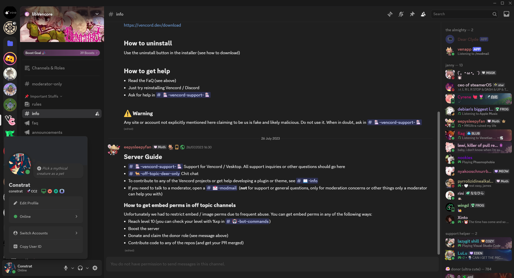

# Revert Discord

A custom CSS theme that reverts Discord's interface to a more classic appearance.

## Overview

Revert Discord is a custom CSS theme that modifies Discord to restore elements from before the April 2025 changes.

- Modified server list sizing and positioning
- Adjusted folder styling and previews
- Classic message styling with improved readability
- Repositioned window controls and top bar elements
- Removed rounded corners for media elements
- And other subtle UI tweaks

## Installation

To use this theme with Discord:

1. Install a browser extension that allows custom CSS (like Vencord)
2. Copy the contents of `revert.css` into your CSS injector
3. Enjoy your reverted Discord experience!

## Customization

You can customize some aspects of the theme by modifying the CSS at the bottom of `revert.css`